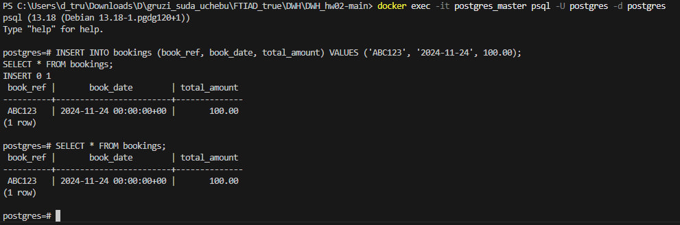

## Авторы
1. **Имайкин Егор Евгеньевич**, [im_egorrrr](https://t.me/im_egorrrr)
2. **Лебедев Никита Александрович**, [nikit_lebedev](https://t.me/nikit_lebedev)
3. **Труфанов Дмитрий Михайлович**, [dimi3_tru](https://t.me/dimi3_tru)
4. **Смирнов Арсений Сергеевич**, [ars_kko](https://t.me/ars_kko)

Группа мФТиАД231

## Как запустить проект

Клонирование проекта из этого репо:
```
git clone https://github.com/DOMENTOR/DWH_hw02
```
Запуск инициализации БД:
```
docker-compose up --build
```
Параметры для подключения:
Мастер
```
psql -h 127.0.0.1 -p 5432 -U postgres -d postgres
```
Слейв:
```
psql -h 127.0.0.1 -p 5433 -U postgres -d postgres
```
DWH:
```
psql -h 127.0.0.1 -p 5434 -U postgres -d postgres
```

Debezium:
```
debezium/commands.sh
```

## Результаты:





```
dbt run -m tag:raw
```


```
dbt run -m tag:stage
```


```
dbt run -m tag:hub
```


